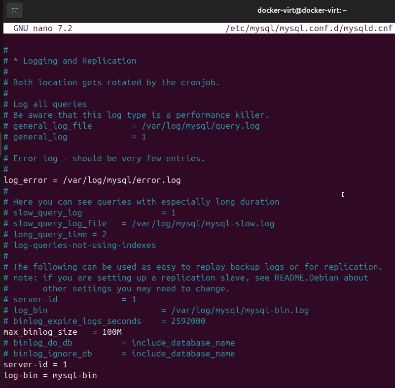
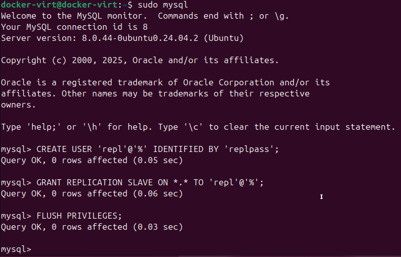
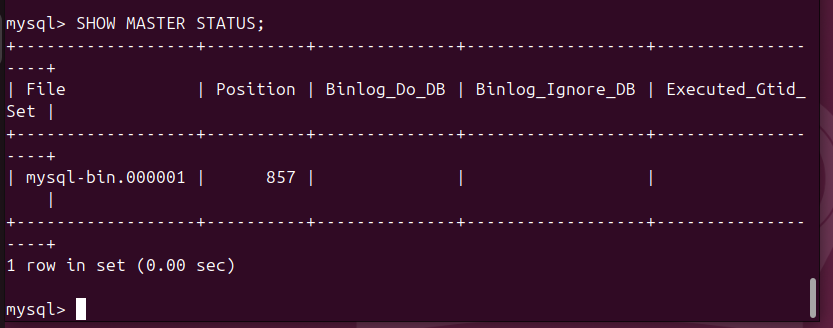
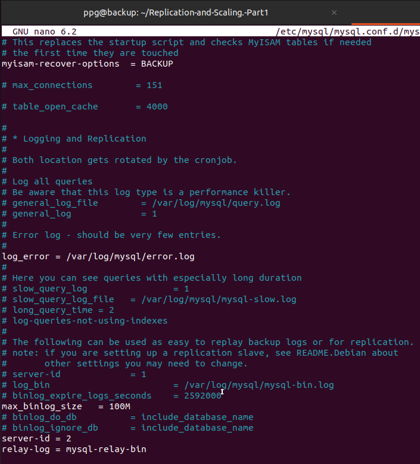
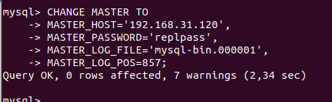
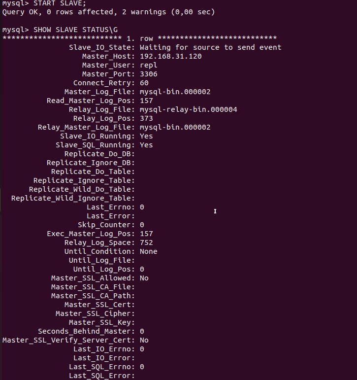
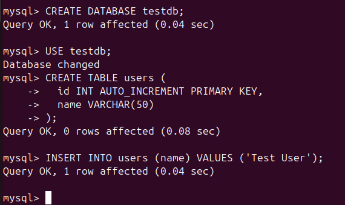
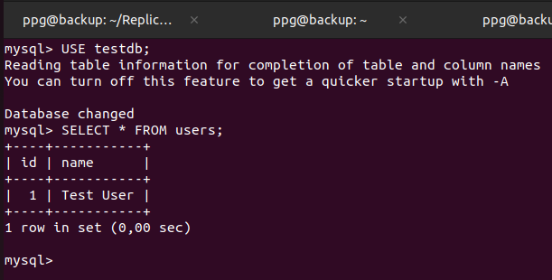

# Домашнее задание к занятию «Репликация и масштабирование. Часть 1» - Петр Петров
### Задание 1.
На лекции рассматривались режимы репликации master-slave, master-master, опишите их различия.  
*Ответить в свободной форме.*

### Решение 1.
Репликация в реляционных базах данных используется для того, чтобы данные хранились не на одном сервере, а на нескольких. Это позволяет повысить надёжность системы и распределить нагрузку. Существует несколько режимов репликации, наиболее распространённые из них — master–slave и master–master.  

В режиме репликации master–slave в системе есть один главный сервер базы данных — master, и один или несколько подчинённых серверов — slave. Все операции изменения данных выполняются только на master. Когда данные на master изменяются, эти изменения автоматически передаются на slave, которые копируют их к себе. Slave-серверы обычно используются только для чтения данных. Такая схема часто применяется в реальных проектах, потому что она достаточно простая в настройке и понятная в администрировании. Основная нагрузка на запись всегда приходится на один сервер, поэтому система хорошо масштабируется именно по операциям чтения, а не записи.  

В режиме репликации master–master в системе используется два или более серверов, и каждый из них является главным. Это означает, что запись данных может выполняться на любом сервере. Все изменения, сделанные на одном master-сервере, передаются другим master-серверам, и наоборот. Таким образом, каждый сервер содержит актуальную копию данных. Такая схема позволяет системе продолжать работу даже в случае отказа одного из серверов, так как другой остаётся доступным для записи и чтения.  

Основное отличие между этими режимами заключается в том, что в master–slave существует только один сервер, на который разрешена запись данных, а в master–master запись возможна на всех серверах одновременно. Из-за этого master–slave считается более простой и предсказуемой схемой, тогда как master–master требует более внимательного администрирования и строгого контроля за изменениями данных, чтобы избежать конфликтов при одновременной записи.  

### Задание 2.
Выполните конфигурацию master-slave репликации, примером можно пользоваться из лекции.

*Приложите скриншоты конфигурации, выполнения работы: состояния и режимы работы серверов.*

### Решение 2.

**1.Настройка master-сервера.**  
Конфигурация MySQL  
  

**2.Создаём пользователя репликации**  
  

**3. Получаем позицию бинарного лога:**  
  

**4. Настройка slave-сервера:**  
Конфигурация MySQL  
  

**5. Указываем master-сервер**  
  

**6. Запускаем репликацию и проверяем состояние репликации**  
  

**7. Проверка передачи данных**  
На master:  
  

На slave:  
  

База данных testdb была автоматически создана на slave, и таблица users
